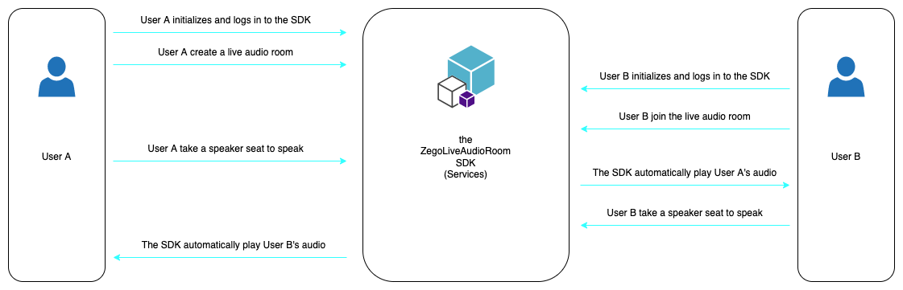
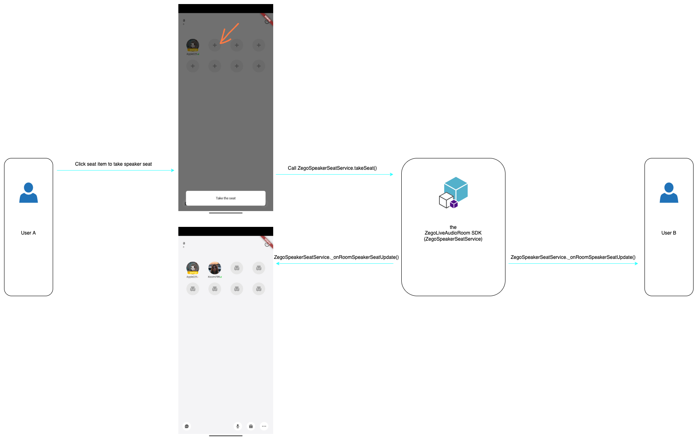
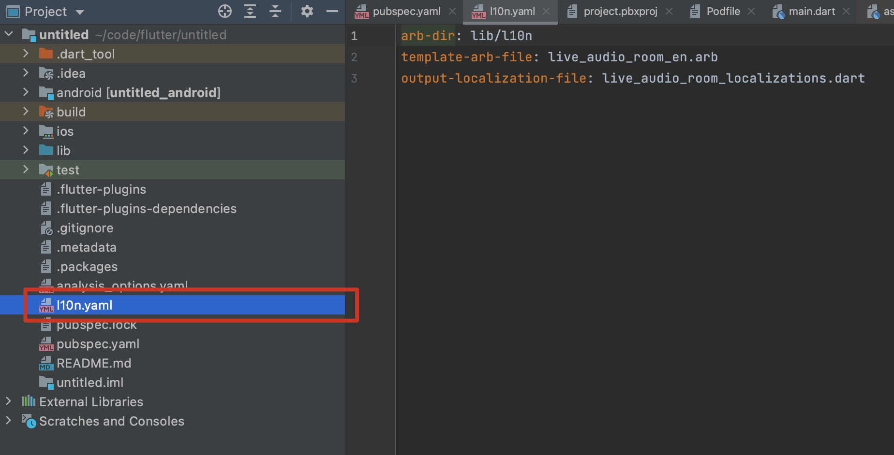
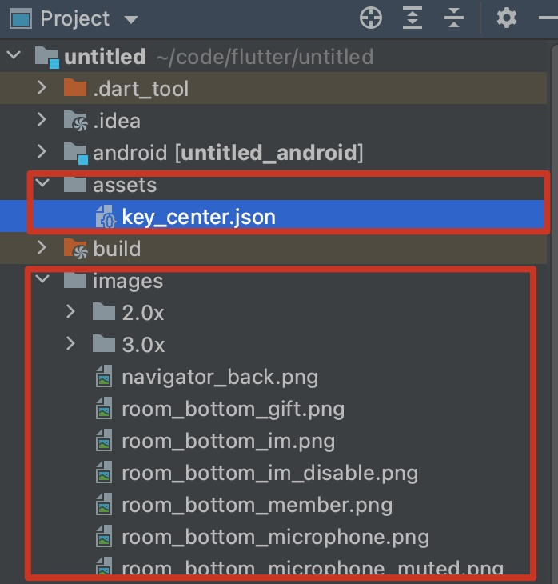
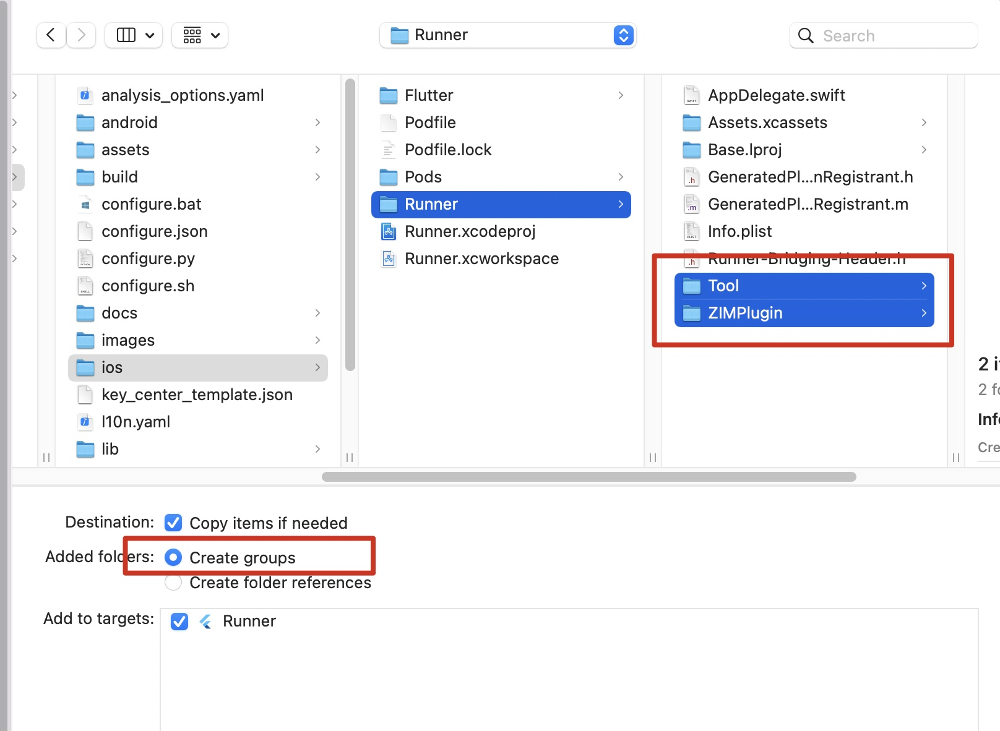
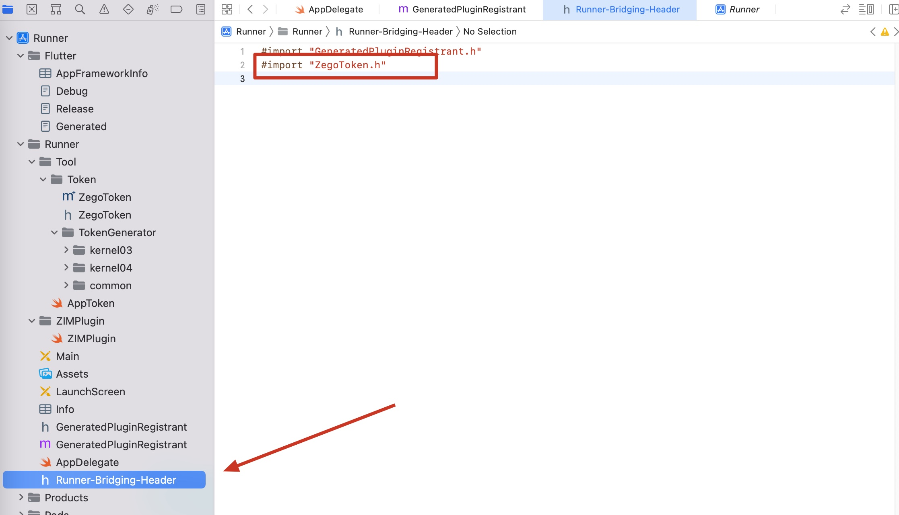
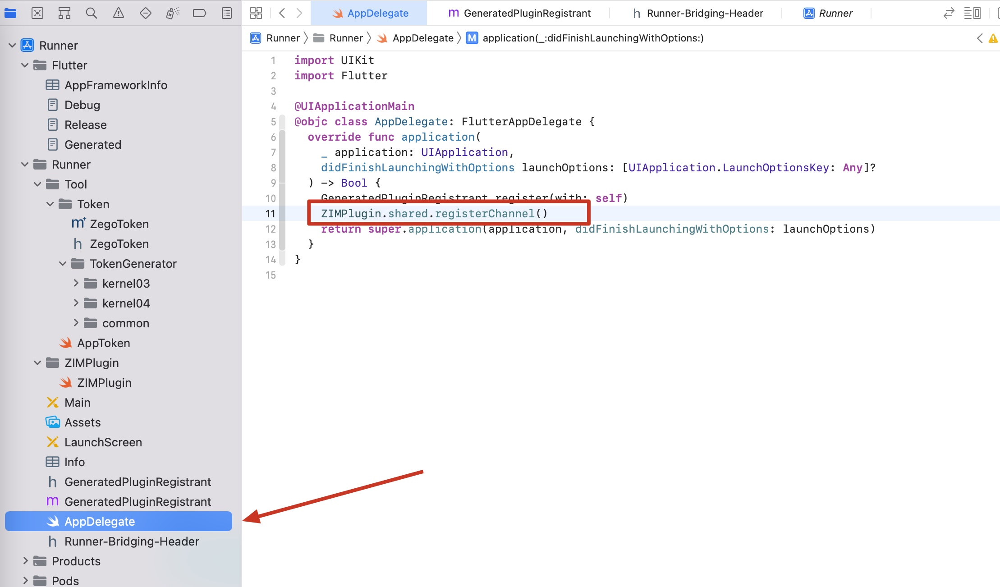
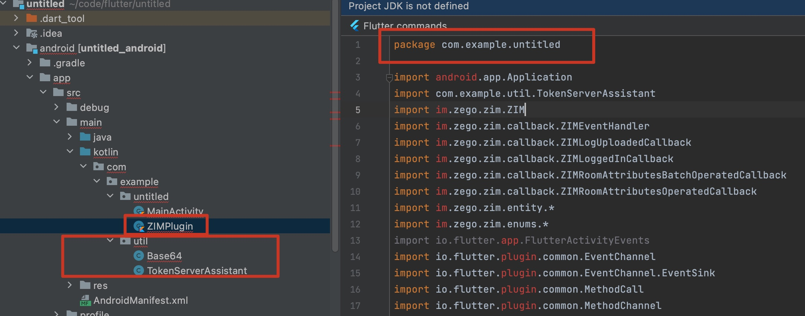

# ZEGOCLOUD Live Audio Room

ZEGOCLOUD's Live Audio Room solution is a one-stop solution for building full-featured live audio rooms into your apps, including interactive live audio streaming, instant messaging, room management, and in-room controls.

In live audio rooms, users can host, listen in, and join live audio conversations. Users can also interact with each other via text chat, virtual gifting, "bullet screen" messages, and other features. In a single room, there can be up to 50 speakers at the same time and an unlimited number of listeners.

With ZEGOCLOUD's Live Audio Room, you can build different types of live audio apps, such as online werewolf, online karaoke, and more.

## Getting started

Before you begin, contact us to activate the Live Audio Room service first, and then do the following:

### Prerequisites

#### Basic requirements

* [Android Studio 2020.3.1 or later](https://developer.android.com/studio)
* [Flutter SDK](https://docs.flutter.dev/get-started/install)
* Create a project in [ZEGOCLOUD Admin Console](https://zegocloud.com/). For details, see [Admin Console - Project management](https://docs.zegocloud.com/article/1271).

The platform-specific requirements are as follows:

#### To build an Android app:

* Android SDK packages: Android SDK 30, Android SDK Platform-Tools 30.x.x or later.
* An Android device or Simulator that is running on Android 4.1 or later and supports audio and video. We recommend you use a real device (Remember to enable **USB debugging** for the device).

#### To build an iOS app:

* [Xcode 7.0 or later](https://developer.apple.com/xcode/download)
* [CocoaPods](https://guides.cocoapods.org/using/getting-started.html#installation)
* An iOS device or Simulator that is running on iOS 13.0 or later and supports audio and video. We recommend you use a real device.

#### Check the development environment

After all the requirements required in the previous step are met, run the following command to check whether your development environment is ready:

```
$ flutter doctor
```


* If the Android development environment is ready, the **Android toolchain** item shows a ready state.
* If the iOS development environment is ready, the **Xcode**  item shows a ready state.

### Modify the project configurations

1. Clone the Live Audio Room Github repository.
2. Open Terminal, navigate to the cloned project repository.
3. Run the configuration script with the `./configure.sh` command. And fill in the AppID, and ServerSecret, which can be obtained in the [ZEGOCLOUD Admin Console](https://console.zego.im/).  
   **Note**: If you are using Windows system, double-click the `configure.bat` to run the configuration script.
   

### Run the sample code

1. Open the Live Audio Room project in Android Studio.
2. Make sure the **developer mode** and **USB debugging** are enabled for the Android device, and connect the Android device to your computer.
3. If the **Running Devices** box in the upper area changes to the device name you are using, which means you are ready to run the sample code.
4. Run the sample code on your device to experience the Live Audio Room service.

## How it work

### Understand the process
The following diagram shows the basic process of creating a live audio room and taking speaker seats to speak:


### UI logic

As shown below, all the UI logic is in the `live_audio_room_flutter/lib/page` directory. And all the room related UI logic is in the `room` directory.


### How to make API calls

The following shows the process of taking a speaker seat with an API call:

1. Call the corresponding method of the service you want to use after making triggering action on the UI. The following is a sample call:
```js
var seats = context.read<ZegoSpeakerSeatService>();
seats.takeSeat(index);
```
2. The SDK sends a broadcast notification to all users in the room, and the users receive the notification through callback. As shown below:
```js
ZegoSpeakerSeatService._onRoomSpeakerSeatUpdate(
      String roomID, Map<String, dynamic> speakerSeat)
```
3. After the event callback is triggered, the related callback handling logic you set will be executed.
   

## Integrate into your project
If you are trying to integrate the live_audio_room SDK into your project instead of building your project with it, make sure you complete the following:

### Add dependencies required by the SDK

```yaml
dependencies:
  flutter:
    sdk: flutter

  # Add the following lines to your "pubspec.yaml" file
  provider: ^6.0.2
  fluttertoast: ^8.0.8
  flutter_hooks: ^0.18.2
  device_info_plus: ^3.2.1
  zego_express_engine: ^2.17.1
  flutter_provider_utilities: ^1.0.4
  loader_overlay: ^2.0.5
  permission_handler: ^9.2.0
  crypto: ^3.0.1
  package_info_plus: ^1.3.0
  flutter_background: ^1.1.0
```
After the `pubspec.yaml` file is modified, run the following command to check whether all dependencies are installed:

```bash
$ flutter pub get
```

### Add i18n configuration
Live Audio Room now has been internationalized. To make the UI components work as expected, make sure you complete the following:

1. Add the line `generate: true` to the `pubspec.yaml` file in flutter section:
```yaml
flutter:
  generate: true # Add this line
```
2. Add the package as a dependency to your `pubspec.yaml` file:
```yaml
dependencies:
  flutter:
    sdk: flutter
  flutter_localizations: # Add this line
    sdk: flutter         # Add this line
```
3. Copy the `l10n.yaml` file from `live_audio_room_flutter` to your project's root directory:
   

4. Import the localizations library to `main.dart` file.
```dart
import 'package:flutter_gen/gen_l10n/live_audio_room_localizations.dart';
```

For more details, see [Internationalizing Flutter apps](https://docs.flutter.dev/development/accessibility-and-localization/internationalization).

### Add assets
Copy the `assets` and `images` folders with it contents from live_audio_room_flutter to your project's root directory:



### Add AppID and ServerSecret configuration
Go to [ZEGOCLOUD Admin Console > My Projects](https://console.zegocloud.com/project), get your AppID and ServerSecret.
Then fill the AppID and ServerSecret in the `key_center.json` file:

```json
{"appID": 123456789, "serverSecret": "xxxxxxxxxxxxxxxxxxxxxxxxxxxxxx"}
```

### Configure an iOS project
1. Grant permissions.

Add `NSCameraUsageDescription` and `NSMicrophoneUsageDescription` key in the `Info.plist` file:
```xml
<?xml version="1.0" encoding="UTF-8"?>
<!DOCTYPE plist PUBLIC "-//Apple//DTD PLIST 1.0//EN" "http://www.apple.com/DTDs/PropertyList-1.0.dtd">
<plist version="1.0">
<dict>
	<key>NSCameraUsageDescription</key><!--Add  this line-->
	<string>We need to use your camera to help you join the voice interaction.</string><!--Add  this line-->
	<key>NSMicrophoneUsageDescription</key><!--Add  this line-->
	<string>We need to use your mic to help you join the voice interaction.</string><!--Add  this line-->
```
2. Copy the `ZIMPlugin` and `Tool` folders.

In Xcode, copy the `ZIMPlugin` and `Tool` folders by right click **Runner > Runner** and select `Add Files to "Runner"`. Then, set the **Add to targets to** option to `Runner`, and select the **Create groups** option.


3. Import the `#import "ZegoToken.h"` into `Bridgin-Header`.
   

4. Add the `ZIMPlugin.shared.registerChannel()` to `AppDelegate`.
   

5. In Podfile, add ZIM dependencies in the `Runner` target section.
```pod
target 'Runner' do
  use_frameworks!
  use_modular_headers!

  flutter_install_all_ios_pods File.dirname(File.realpath(__FILE__))
  pod 'ZIM','1.3.7' # Add this line
end
```

### Configure an Android project
1. Grant permissions.

Add `uses-permission` tag to the `AndroidManifest.xml` file.
```xml
<manifest xmlns:android="http://schemas.android.com/apk/res/android"
    package="com.example.untitled">

    <uses-permission android:name="android.permission.RECORD_AUDIO" /><!--Add this line-->
```
2. Copy the `ZIMPlugin` and `util` folders.

Copy the `.kt` files to the `kotlin` folder and change all the package name of these files to the corresponding file path:


3. Update the `MainActivity.kt` file.

Add the following lines to the head of the `MainActivity.kt`:
```kotlin
import io.flutter.embedding.android.FlutterActivity
import io.flutter.embedding.engine.FlutterEngine
import io.flutter.plugin.common.MethodChannel
import io.flutter.plugin.common.EventChannel
import com.example.untitled.ZIMPlugin
```
And copy the `configureFlutterEngine` function to the `MainActivity`:
```kotlin
class MainActivity: FlutterActivity() {
    override fun configureFlutterEngine(flutterEngine: FlutterEngine) {
        super.configureFlutterEngine(flutterEngine)

        val pluginHandler = ZIMPlugin()

        val messenger = flutterEngine.dartExecutor.binaryMessenger
        val channel = MethodChannel(messenger, "ZIMPlugin")

        channel.setMethodCallHandler { call, result ->
            when(call.method) {
                "createZIM" -> { pluginHandler.createZIM(call, result, application) }
        ...
```
4. Add ZIM dependencies to the `build.gradle` file in app section:
```gradle
dependencies {
    implementation "org.jetbrains.kotlin:kotlin-stdlib-jdk7:$kotlin_version"

    api 'com.github.zegolibrary:zim:1.3.2' // Add this line
}
```

### Start building your app project
Your app project will be ready to build on iOS and Andorid devices after all the configurations has completed. Then, you can run the command below and start building your project in Android Studio:

```bash
$ flutter clean
```

## More documentation
You can find more documentation on our official website: [Live Audio Room](https://doc-en.zego.im/article/13746).

## Tips
The error ```CocoaPods could not find compatible versions for pod "ZegoExpressEngine"``` occurs when running pod install: Use the ```pod install --repo-update``` command to update.